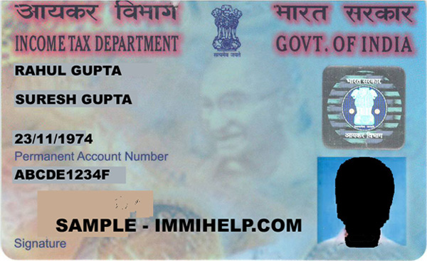
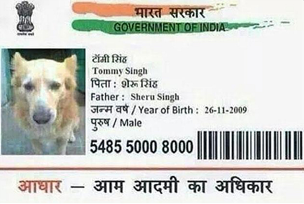
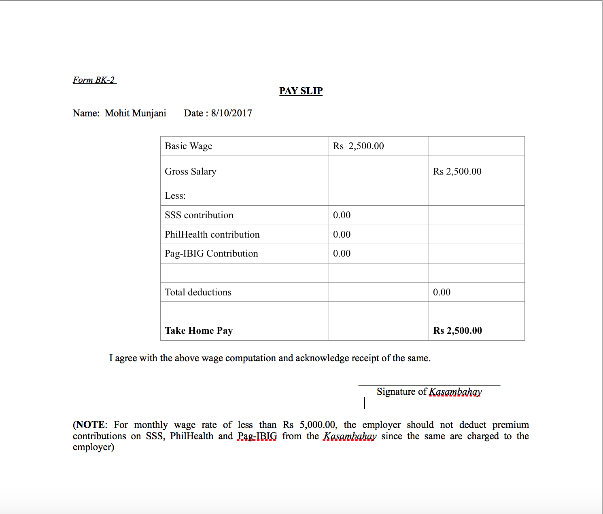
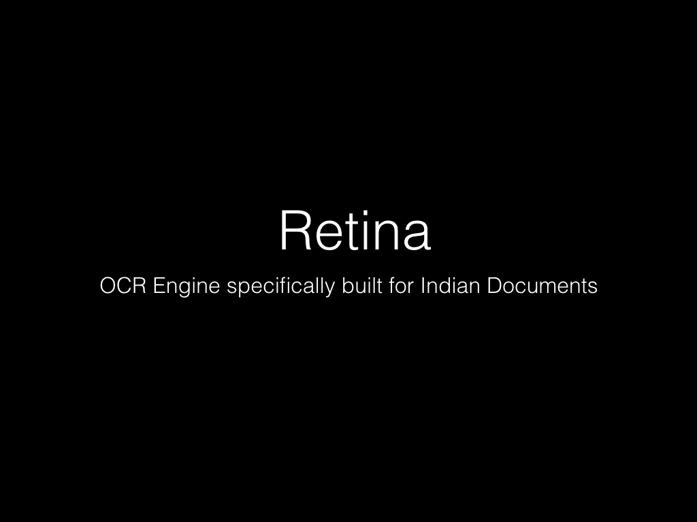
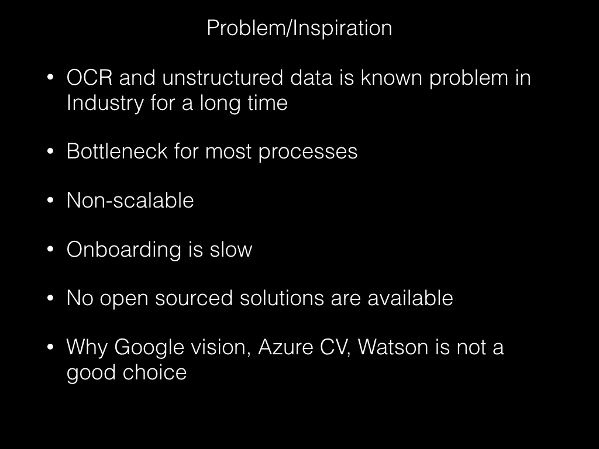
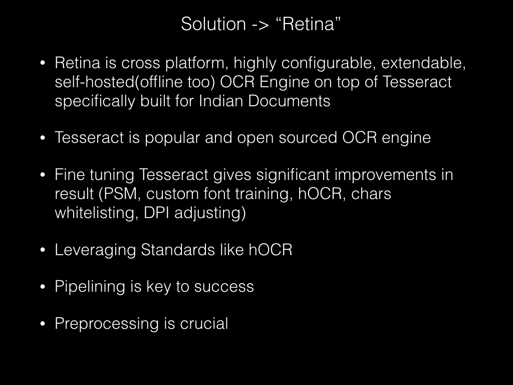
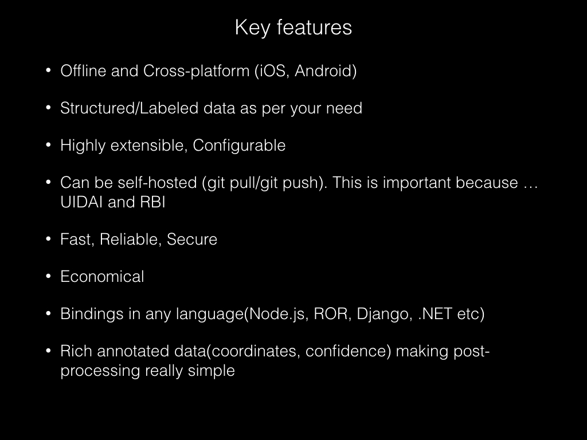
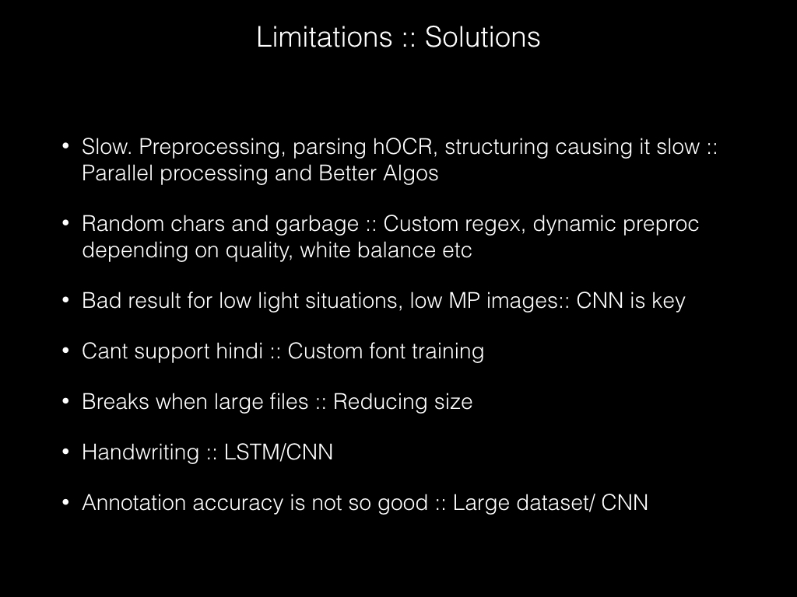
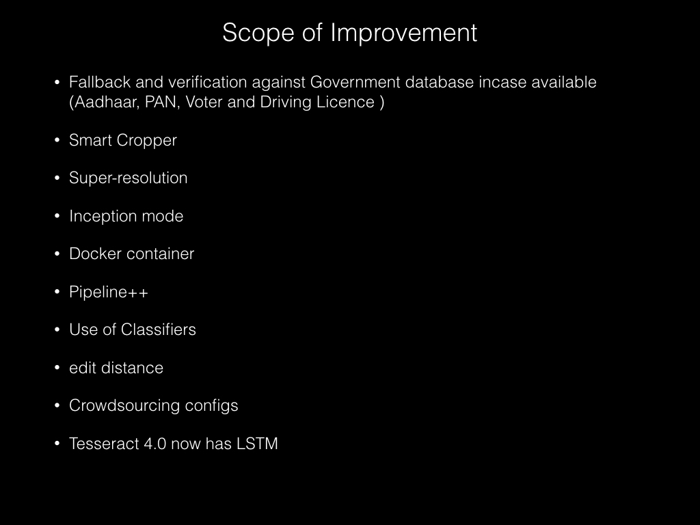
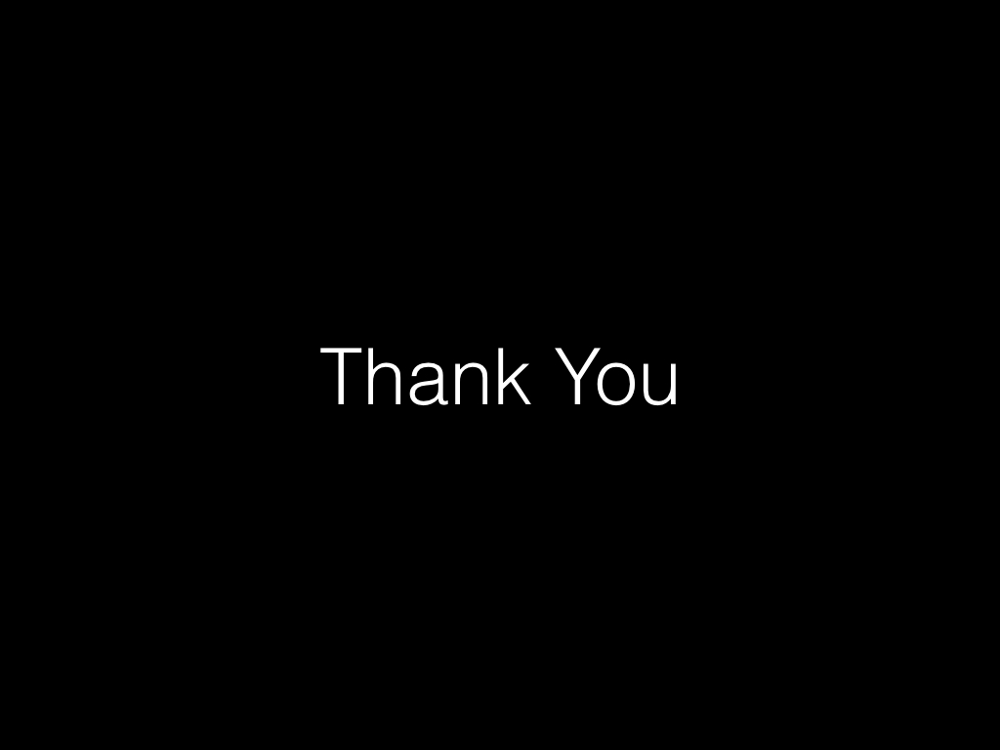

### Retina

Cross-platform, Configurable, Extendable, Self-hosted(offline too) OCR Engine specifically built for Indian Documents(Built during SBCHackathon Oct 6-7-8 2017)

following are few results I coult achieve


```json
{"name":[{"value":"SURESH GUPTA","words":[{"text":"suresh","confidence":[82]},{"text":"gupta","confidence":[84]}]}],"fathers_name":[{"value":"SURESH GUPTA","words":[{"text":"suresh","confidence":[82]},{"text":"gupta","confidence":[84]}]}],"pan_no":[{"value":"ABCDE1234F","words":[{"text":"abcde1234f","confidence":[81]}]}],"dob":[{"value":"‘ 23/1 1/J 974","words":[{"text":"‘","confidence":[28]},{"text":"23/1","confidence":[87]},{"text":"1/j","confidence":[63]},{"text":"974","confidence":[83]}]}],"type":"PAN","raw":"                                                                                                ' INCOME TAX DEPARTMENT                               i RAHUL GUPTA             SURESH GUPTA                               ‘ 23/1 1/j 974             Permanent Account Number                               ABCDE1234F                                                                 ‘ “I?“             SAMPLE - IMMIHELP.COM                               Signature ' - .. .\"             ‘ ‘_ ‘                               x, 8' “MA“                      "}
```


```json
{"name":[{"value":"TOMLIN SINGH","words":[{"text":"tomlin","confidence":[71]},{"text":"singh","confidence":[74]}]}],"aadhaar_no":[{"value":"' J” 548550008000LLLLLLLLLLLLLLLLLLLLLLLILLLL","words":[{"text":"'","confidence":[40]},{"text":"j”","confidence":[24]},{"text":"548550008000lllllllllllllllllllllllillll","confidence":[78]}]}],"type":"AADHAAR","raw":"                                                                                                 am [335             Tomlin Singh                               \"- 3* 3% War: 9mm:             : \";f‘ Father: ShcruSlngh             ‘1 -- mW/Yearof Birth: 26-11-2009                               35?] Male                               ' j” 548550008000lllllllllllllllllllllllIllll                               m                      "}
```


```json
{"name":[{"value":"NAME: MOHIT MUNJANI DALEZSLLO/ZOW","words":[{"text":"name:","confidence":[67]},{"text":"mohit","confidence":[66]},{"text":"munjani","confidence":[78]},{"text":"dalezsllo/zow","confidence":[66]}]}],"pay":[{"value":"","words":[{"text":"","confidence":[95]}]},{"value":"","words":[{"text":"","confidence":[95]}]},{"value":"","words":[{"text":"","confidence":[95]}]},{"value":"","words":[{"text":"","confidence":[95]}]},{"value":"GROSS SALARY RS 2,500.00","words":[{"text":"gross","confidence":[87]},{"text":"salary","confidence":[72]},{"text":"rs","confidence":[80]},{"text":"2,500.00","confidence":[57]}]}],"type":"SALARY SLIP","raw":"                                mm             BAY SLIP                               Name: Mohit Munjani Dalezsllo/ZOW                                                                                                                                                                                                                                                                                                                                                                                                                                                                                               Basic Wag: Rs 2.50000             Gross Salary Rs 2,500.00             Less:             555 Conlribmion 0.00             Phichahh cunrribulion 0.00             Pag-lEIG Conmbunon 0.00             Total deducnons 0.00             Takc Ham: Pay R: 2,500.00             I agree with tl'w Ibove wag: wmpumian and acknowledge meipt oflh: m.             Sigma“: ofKMarnbahay                               (NOTE: Far mmlhly wise me of less nun Rs 5,000.00, an employer should not deduct premium             contributions on 555, Pun-1mm and Pug-BIG mm the Kmmbahay since 0:: same are changed m we                               -plnyer)                                                                                      "}
```

### Dependancy

 * Tesseract
 * Imagemagic

### How to run
 
its simple ruby script. run pipeline() with file name as parameter

### Presentation







